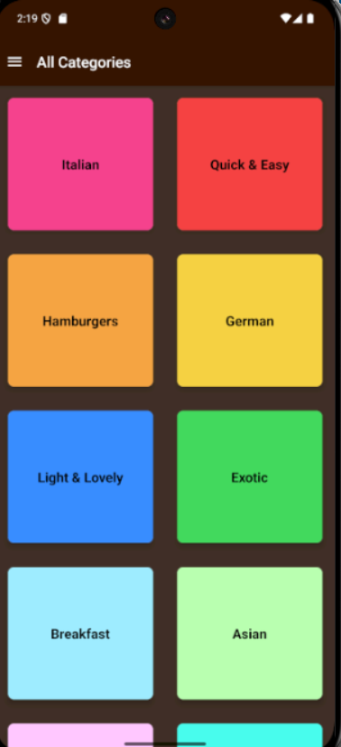
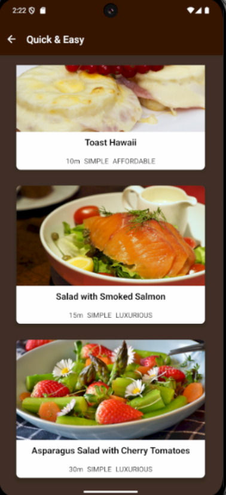
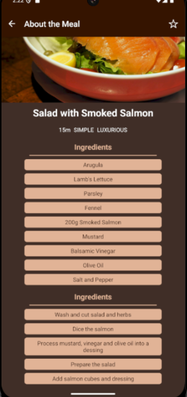

# 🍳 Recipe Book App

A beautifully designed **React Native + Expo** app that lets users browse, view, and explore a collection of delicious recipes.  
Built with a focus on simplicity, clean UI, and smooth navigation.

---

## 📱 Screenshots

| Home Screen | Recipe List | Recipe Details |
|--------------|--------------|----------------|
|  |  |  |


---

## 🚀 Features

- 🍲 Browse a variety of recipes by category  
- 🔍 View detailed recipe information (ingredients & steps)  
- ❤️ Add or remove recipes from your favorites  
- 🧭 Smooth navigation using React Navigation  
- 🌙 Simple and elegant user interface  
- ⚡ Built with **React Native + Expo**

---

## 🛠️ Installation & Setup

1. Clone this repository:
   ```bash
   git clone https://github.com/yourusername/recipe-book-app.git
   ```
2. Navigate to the project directory:
   ```bash
   cd recipe-book-app
   ```
3. Install dependencies:
   ```bash
   npm install
   ```
   or
   ```bash
   yarn
   ```
4. Start the Expo development server:
   ```bash
   npx expo start
   ```
5. Scan the QR code with your Expo Go app or run on an emulator.

---

## 🤝 Contributing

Contributions are welcome! Please open an issue or submit a pull request for any feature requests or bug fixes.

---

